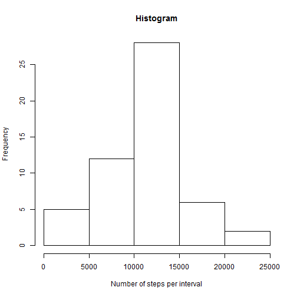
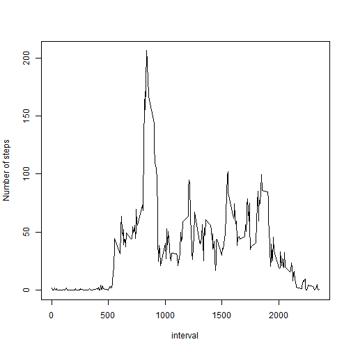
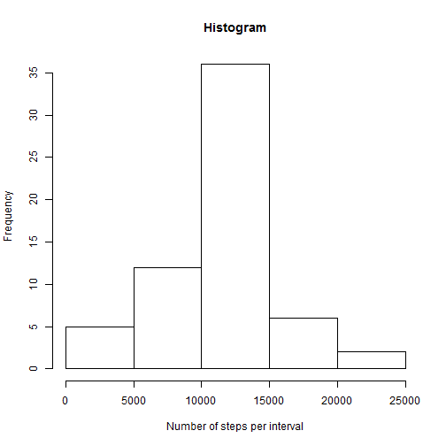

------

## Loading and preprocessing the data


1. Loading the data

```r
repdata <- read.csv("activity.csv")
```

2. Transforming "date" variable to R `'Date'` class

```r
repdata$date <- as.Date(repdata$date, format = "%Y-%m-%d")
```

------

## What is mean total number of steps taken per day?

1. Histogram of the total number of steps taken each day
+ **First**: calculating the **mean of total number of steps per day** (using `aggregate` function)

```r
steps_per_day <- aggregate(steps ~ date, data = repdata, FUN = sum)
```

+ **Second**: histogram

```r
hist(
       steps_per_day$steps,
       main = "Histogram", 
       xlab = "Number of steps per interval"
)
```

 

2. Reporting the **mean** and **median** of total number of steps per day

```r
Mean <- mean(steps_per_day$steps)
Median <- median(steps_per_day$steps)
```
+ The **mean** and **median** of total number of steps taken per day are 10766.189 and 10765, respectively.

------

## What is the average daily activity pattern?

1. Time series plot.
+ **First**: Calculating the average daily activity pattern

```r
daily_activity_pattern <- aggregate(
       steps ~ interval, 
       data = repdata, 
       FUN = mean
)
```

+ **Second**: The plot

```r
plot(
       steps ~ interval, 
       data = daily_activity_pattern, 
       ylab = "Number of steps",
       type = "l"
)
```

 

2. The 5-minute interval, on average across all the days in the dataset, contains the maximum number of steps is:

```r
daily_activity_pattern[which.max(daily_activity_pattern$steps), ]
```

```
##     interval    steps
## 104      835 206.1698
```


------

## Imputing missing values

1. Total number of missing values in the dataset (i.e. the total number of rows with NAs):

```r
sum(!complete.cases(repdata))
```

```
## [1] 2304
```

2. Strategy for filling in all of the missing values in the dataset: the mean value for a 5-minute interval was used.

3. New dataset (`repdata_filled`) with the missing data filled in.

```r
repdata_filled <- data.frame() # empty data frame
intervals <- unique(repdata$interval) # 5-minute intervals
for(i in 1:length(intervals)){
       dfi <- subset(repdata, interval == intervals[i]) # i interval data
       mean_step <- mean(dfi$steps, na.rm = TRUE) # mean value for i interval 
       # imputing
       dfi$steps <- ifelse(is.na(dfi$steps), yes = mean_step, no = dfi$steps)
       repdata_filled <- rbind(repdata_filled, dfi) # filling empty data frame
}
```

4. Histogram of the total number of steps per day and mean and median of total number of steps taken per day.

+ **First**: calculating the **mean of total number of steps per day** 

```r
steps_per_day <- aggregate(steps ~ date, data = repdata_filled, FUN = sum)
```

+ **Second**: histogram

```r
hist(
       steps_per_day$steps,
       main = "Histogram", 
       xlab = "Number of steps per interval"
)
```

 

+ **Third**: reporting the **mean** and **median** of total number of steps per day

```r
Mean <- mean(steps_per_day$steps)
Median <- median(steps_per_day$steps)
```

The **mean** and **median** of total number of steps taken per day are 10766.189 and 10766.189, respectively. Even though the imputation strategy did not have an impact on the mean value, the median value was affected, which implies an effect on the variation and distribution of data.

------

## Are there differences in activity patterns between weekdays and weekends?

1. Creating a new factor variable with two levels -- "weekday" and "weekend" using the filled-in missing dataset.

+ **First**: a function called `days` is created. This function returns "weekend" if date is 'saturday' or 'sunday'. Otherwise, it returns "weekday"

```r
days <- function(date){
       # date: an object of class "Date".
       ifelse(
               weekdays(date) == "Sunday" | weekdays(date) == "Saturday",
               yes = "weekend", 
               no = "weekday"
       )  
}
```

+ **Second**: using the `days` function to create the new **factor** variable

```r
repdata_filled$weekday <- as.factor(days(repdata_filled$date))
```

2. Panel plot containing a time series plot of the 5-minute interval and the average number of steps, averaged across all weekday days or weekend days.

+ **First**: calculating the average number of steps per interval and day class (weekday or weekend):

```r
daily_activity_pattern <- aggregate(
       steps ~ interval*weekday, 
       data = repdata_filled, 
       FUN = mean
)
```

+ **Second**: time series plot.

```r
library(lattice) 
xyplot(
       steps ~ interval | weekday, 
       data = daily_activity_pattern, 
       type = "l",
       ylab = "Number of steps",
       layout = c(1, 2)
)
```

 
